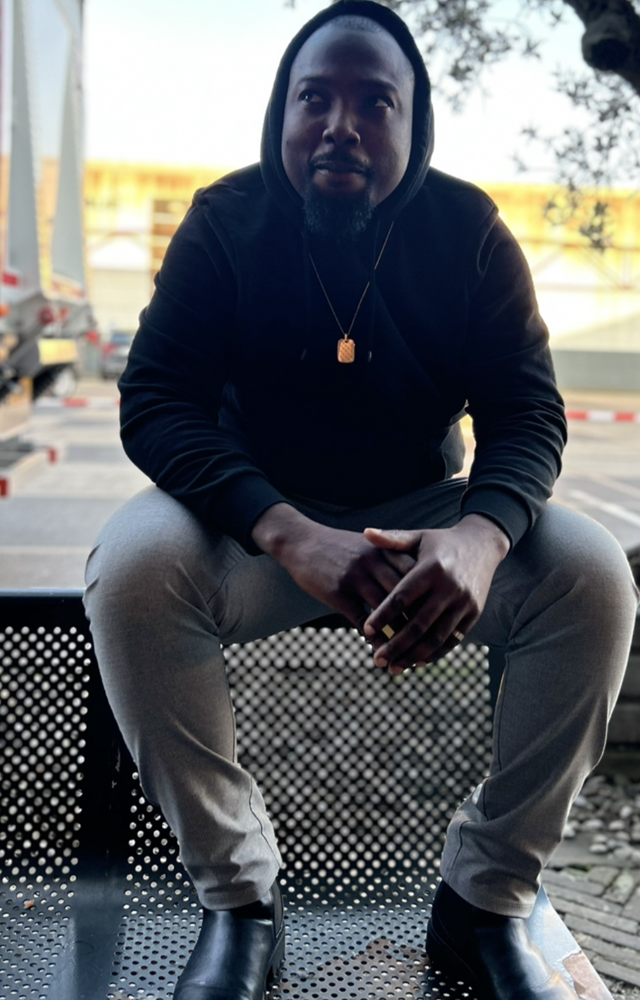

# Introduction

Ebenezer Osei Biney is my name. I am from Ghana in west africa and i live in
Belgium with my family. _I am very excited to be part of **HACK YOUR FUTUER**
organiztion and to meet new people and new culture in this society. I have been
searching for an organization like for a long time, so i can be able to join a
community of developers.I would love to teach and learn more from other to
explore more skills. I know I am self-motivated and I am always look forward to
experience. I am ready to acquire the knowledge. I am very passionate about
**IT** really want do more._

## Things i like to do in my free time

- Listering to music
- Watching good movies,series and football
- Playing america football
- Playing football

### My Achievemants

- 👨‍🎓I'm looking forward in collaborate in group project.
- 💻 I want learn more about git and github commands
- 🐱‍👤 I want to become a ninja in the developer world

### About me

1. I am an easy giong person
2. I belive in **HONOUR,RESPECT and being TRUSTWORTHY**.

   How you can reach me
   :[linkedin](https://www.linkedin.com/in/osei-biney-3a7034266?lipi=urn%3Ali%3Apage%3Ad_flagship3_profile_view_base_contact_details%3BWEICIui1StW7btYhPyv3NA%3D%3D)

   [Github](https://github.com/Osei-b4)

   
